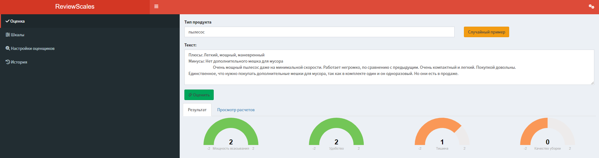

# ReviewScales
A framework for quantifying multi-dimensional product perceptions from customer reviews

## Disclaimer

⚠️ **Important Notices:**

- This project is developed by an enthusiast, not a professional programmer
- The application is primarily designed for Russian-language reviews and interface
- Expect ongoing improvements and potential bugs

## Key Features

### Semantic Analysis Methods

- **Zero-Shot Classification**: derive ratings through comparative zero-shot evaluations
- **AI-Powered Chat Analysis**: Prompt large language models to simulate human content analysis

### Semantic Scale Customization

- **Semantical Rating System**: Use a [-2, 2] scale for sentiment mapping
- **Intuitive Scale Editor**: Easily modify and create semantic dimensions

### Planned Enhancements

- Batch text processing support
- Expanded language model compatibility
